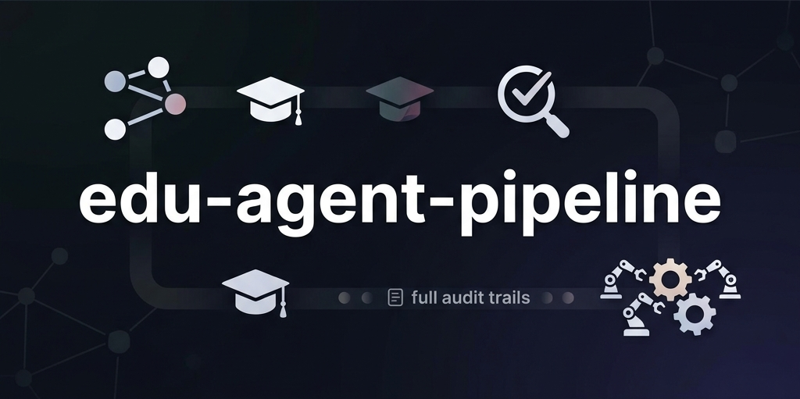

<div align="center">


# edu-agent-pipeline

**governed ai pipeline for educational content — generate, review, refine, tag**

[](https://python.org)
[](https://streamlit.io)
[](https://ai.google.dev)
[](LICENSE)

</div>

a governed ai pipeline that generates, reviews, refines, and tags educational content — with full audit trails. four specialized agents collaborate through a deterministic orchestrator: generator creates grade-appropriate content, reviewer scores it quantitatively, refiner fixes issues using field-level feedback, and tagger classifies approved output.

every run produces a `RunArtifact` — a single json document capturing inputs, all draft attempts, review scores, refinement logs, the final decision, and timestamps. nothing gets lost.

## how it works

```
┌──────────────┐     ┌──────────────┐     ┌──────────────┐     ┌──────────────┐
│  generator   │ ──► │  reviewer    │ ──► │  refiner     │ ──► │  tagger      │
│              │     │              │     │  (if needed)  │     │ (if approved) │
│ grade + topic│     │ scores 1-5   │     │ max 2 tries   │     │ subject,     │
│ → explanation│     │ field issues │     │ uses feedback  │     │ difficulty,  │
│ → 3 MCQs     │     │ pass / fail  │     │ to improve    │     │ bloom's level│
│ → teacher    │     │              │     │              │     │              │
│   notes      │     │              │     │              │     │              │
└──────────────┘     └──────────────┘     └──────────────┘     └──────────────┘
```

the orchestrator enforces a bounded, deterministic flow:

```
1. generate draft (1 internal schema retry)
2. review draft
3. if PASS → tag → APPROVED
4. if FAIL → refine (attempt 1) → review
   a. if PASS → tag → APPROVED
   b. if FAIL → refine (attempt 2) → review
      i.  if PASS → tag → APPROVED
      ii. if FAIL → REJECTED
```

pass/fail is decided in python, not by the llm. the model produces scores, but thresholds are enforced deterministically in code.

## agent roles

**generator** — takes a grade level (1-12) and topic. produces a structured `ContentArtifact` with an age-appropriate explanation, 3 multiple-choice questions (with `correct_index`), and teacher notes. language complexity scales automatically by grade band. retries the llm call once on schema validation failure.

**reviewer** — evaluates content on four dimensions (age appropriateness, correctness, clarity, coverage), each scored 1-5. produces field-referenced feedback using dot-paths like `explanation.text` or `mcqs[1].question` so issues are precisely traceable.

**refiner** — takes a failing draft plus the reviewer's field-level feedback and rewrites only the broken parts. the orchestrator caps refinement at 2 attempts — if it still fails, content gets rejected.

**tagger** — only runs on approved content. classifies by subject, difficulty, content types, and bloom's taxonomy level. tagger failure doesn't reject otherwise-approved content.

## quality gates

thresholds enforced in `agents/reviewer.py`:

| dimension | minimum score |
|---|---|
| age appropriateness | ≥ 4 |
| correctness | ≥ 4 |
| clarity | ≥ 4 |
| coverage | ≥ 3 |
| **average (all four)** | **≥ 4.0** |

all conditions must hold simultaneously. scores come from the llm, but the gate is deterministic python.

## tech stack

- **python 3.10+**
- **streamlit** — interactive ui with pipeline visualization, attempt logs, score cards
- **fastapi + uvicorn** — rest api (`POST /generate`, `GET /history`)
- **pydantic v2** — strict schema validation for every agent input/output
- **sqlite** — persistence for run artifacts (auto-created `edu_pipeline.db`)
- **google gemini** (`gemini-3-flash-preview`) — llm backend via google gen ai sdk
- **pytest** — tests mock the llm client, no api key needed

## project structure

```
edu-agent-pipeline/
├── agents/
│   ├── generator.py          # content generation with schema retry
│   ├── reviewer.py           # quantitative scoring + pass/fail gating
│   ├── refiner.py            # feedback-driven content improvement
│   └── tagger.py             # classification of approved content
├── tests/
│   ├── test_schema_validation.py
│   ├── test_refine_pass.py
│   └── test_refine_reject.py
├── api.py                    # fastapi endpoints
├── app.py                    # streamlit ui
├── llm.py                    # llm client wrapper (single mock point)
├── orchestrator.py           # deterministic pipeline → RunArtifact
├── prompts.py                # prompt templates for all agents
├── schemas.py                # pydantic models (strict contracts)
├── storage.py                # sqlite persistence
├── demo_data.py              # pre-built responses for demo mode
├── requirements.txt
├── .env.example
└── .gitignore
```

## setup

### 1. clone and install

```bash
git clone https://github.com/swarajduttacv/edu-agent-pipeline.git
cd edu-agent-pipeline
python -m venv venv
venv\Scripts\activate          # windows
# source venv/bin/activate     # mac/linux
pip install -r requirements.txt
```

### 2. configure api key

get a key from [google ai studio](https://aistudio.google.com/apikey).

```bash
cp .env.example .env
# edit .env and paste your key
```

### 3. run

**streamlit ui:**

```bash
streamlit run app.py
```

**fastapi (api-only):**

```bash
uvicorn api:app --reload
```

api docs at `http://localhost:8000/docs`.

**demo mode** — toggle it in the sidebar or set `DEMO_MODE=true` in your env. runs the full pipeline with pre-built responses when your api quota is exhausted. all validation, scoring, and orchestration still execute normally.

## api usage

```bash
# generate content
curl -X POST http://localhost:8000/generate \
  -H "Content-Type: application/json" \
  -d '{"user_id": "u123", "grade": 5, "topic": "Fractions as parts of a whole"}'

# view history
curl "http://localhost:8000/history?user_id=u123"
```

## testing

```bash
pytest tests/ -v
```

all tests mock the llm client — no api key needed.

| test | what it covers |
|---|---|
| `test_schema_validation.py` | generator returns invalid output → pipeline rejects gracefully with error trail |
| `test_refine_pass.py` | draft fails review → refiner fixes it → passes second review → approved with tags |
| `test_refine_reject.py` | draft fails → 2 refinement attempts both fail → rejected, no tags, all attempts logged |

## design decisions

- **full RunArtifact as json in sqlite** — keeps the audit trail intact without schema migrations. could normalize later, but not needed at this scale.
- **pass/fail in code, not llm** — llms are non-deterministic; applying thresholds in python ensures consistent gating across runs.
- **2 refinement attempts max** — bounds api cost and prevents infinite retry loops on inherently difficult topics.
- **single `llm.py` module** — one mock point for all tests. swapping llm providers is a one-file change.
- **tagger failure doesn't reject content** — tags are metadata, not quality. if content passes review but tagging fails, it's still approved.
- **google gemini (free tier)** — easy for anyone to test without billing setup.

## license

[MIT](./LICENSE)
